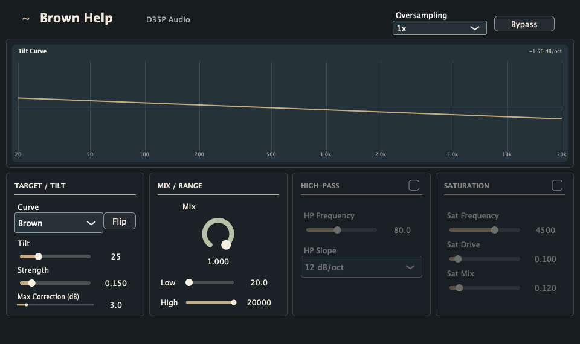

# Brown Help

Brown Help is a VST3 tonal balancer for podcasts and voice-over work by **D35P Audio**.



It listens to the incoming voice, compares its broad spectral shape to a brown-noise-style tilt, and applies gentle adaptive EQ so dialogue settles closer to that target. It is meant as a practical "make this voice sit better" tool, not as a surgical repair plugin or a loudness maximizer.

## Status

- Format: VST3
- Framework: JUCE + CMake
- Primary test host: REAPER on macOS
- Supported channel layouts: mono and stereo
- Intended platforms: macOS, Windows, Linux
- Current maturity: early, usable, still evolving

## Features

- Adaptive spectral correction toward a brown-style target curve
- Musical `Tilt` control from `0` to `100`, plus `Flip` for positive tilt
- `Mix`, `Strength`, `Correction`, and `Speed` controls
- User-selectable correction range with `Low` and `High`
- Optional high-pass filter with `12 dB/oct` or `24 dB/oct` slope
- Optional high-band saturation for soft voice presence
- Automatic output gain compensation and final output guard
- 1x, 2x, and 4x oversampling
- Compact custom JUCE UI

## Signal Flow

```text
Input
  -> optional High-Pass
  -> adaptive Brown Help EQ
  -> optional High Saturation
  -> automatic gain compensation
  -> output guard
Output
```

## How It Works

### Low / High

`Low` and `High` define the frequency range where the adaptive correction is allowed to work. They are not filters.

Example: if `Low` is set to `100 Hz`, Brown Help stops correcting below `100 Hz`, but low-frequency audio can still pass through unless the high-pass filter is enabled.

### High-Pass

`High Pass` is a real filter. It removes low-frequency audio before the adaptive EQ, which helps keep rumble, plosives, and mic handling noise from driving the detector.

### Adaptive EQ

The processor uses log-spaced analysis bands inside the selected range. Each band tracks incoming energy, compares it to the selected tilt curve, then applies a smoothed peaking-EQ correction.

Cuts are stronger than boosts by design. This lets the plugin tame harsh or over-present areas without aggressively lifting room tone, hiss, or noise.

### Tilt

The `Tilt` knob is a musical control, not a raw slope parameter.

- `0` means flat target.
- `100` maps to the maximum negative brown-style slope.
- `Flip` mirrors the curve to the positive side.
- Curve choices currently change the available slope amount, not the correction algorithm itself.

### Saturation

`High Saturation` is applied after the adaptive EQ. It affects the upper band only and is designed to add subtle density for spoken voice rather than obvious distortion.

### Auto Gain And Output Guard

After EQ and saturation, Brown Help applies lightweight automatic gain compensation to reduce perceived level drops. A final output guard catches runaway peaks and prevents large output jumps.

## Recommended Starting Point

- Curve: `Brown`
- Tilt: `25`
- Flip: off
- Strength: `15%`
- Mix: `100%`
- Correction: `3 dB`
- Speed: `45%`
- Low: `70-100 Hz`
- High: `16000-20000 Hz`
- Oversampling: `1x`
- High Pass: optional, around `70-90 Hz`
- Saturation: optional, low Drive and Mix

For normal podcast rendering in REAPER, start with `1x` oversampling and a Release build.

## Building

Requirements:

- CMake 3.22+
- A C++17 compiler
- Git, so CMake can fetch JUCE

Configure and build Release:

```sh
cmake -S . -B build-release -DCMAKE_BUILD_TYPE=Release
cmake --build build-release --config Release
```

Configure and build Debug:

```sh
cmake -S . -B build -DCMAKE_BUILD_TYPE=Debug
cmake --build build --config Debug
```

Run tests:

```sh
ctest --test-dir build --output-on-failure
ctest --test-dir build-release --output-on-failure
```

Release VST3 output:

```text
build-release/BrownHelp_artefacts/Release/VST3/Brown Help.vst3
```

On macOS, copy the `.vst3` bundle to:

```text
~/Library/Audio/Plug-Ins/VST3/
```

Then rescan plugins in REAPER.

## Development Notes

- The plugin code lives in `Source/`.
- Parameter IDs and defaults live in `Source/Parameters.h`.
- UI styling and shared controls are split across `Source/UiStyle.h`, `Source/ParameterFormatting.h`, and `Source/BrownHelpUiComponents.*`.
- DSP behavior is centered around `Source/BrownCurveBalancer.*` and `Source/BrownHelpProcessor.*`.
- Tests live in `Tests/`.

Use Debug builds while developing, but judge CPU cost and render speed from Release builds only.

## License

Brown Help is released under the GNU General Public License v3.0 only. See [LICENSE](LICENSE).

This project uses JUCE. If you distribute binaries commercially or want to use a non-GPL license, check the current JUCE licensing terms and obtain the appropriate JUCE license.
